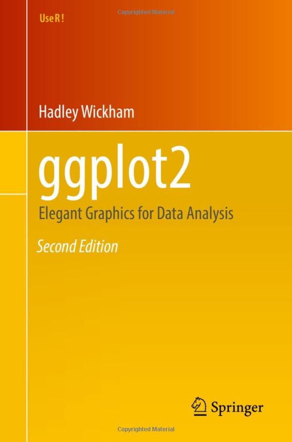

--- 
title: ggplot2
subtitle: Elegant Graphics for Data Analysis
author: "Hadley Wickham, Danielle Navarro, and Thomas Lin Pedersen"
site: bookdown::bookdown_site

documentclass: book

bibliography: references.bib
csl: chicago-fullnote-bibliography.csl
link-citations: yes
---

`r if (knitr::is_latex_output()) '<!--'` 

# Welcome {-}

 This is the on-line version of work-in-progress **3rd edition** of "ggplot2: elegant graphics for data analysis" published by Springer. You can learn what's changed from the 2nd edition in the [Preface](#preface-3e).

While this book gives some details on the basics of ggplot2, it's primary focus is explaining the Grammar of Graphics that ggplot2 uses, and describing the full details. It is not a [cookbook](https://r-graphics.org), and won't necessarily help you create any specific graphic that you need. But it will help you understand the details of the underlying theory, giving you the power to tailor any plot specifically to your needs.

The book is written by [Hadley Wickham](http://hadley.nz), [Danielle Navarro](https://djnavarro.net), and [Thomas Lin Pedersen](https://www.data-imaginist.com).

`r if (knitr::is_latex_output()) '-->'`
